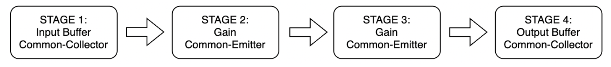
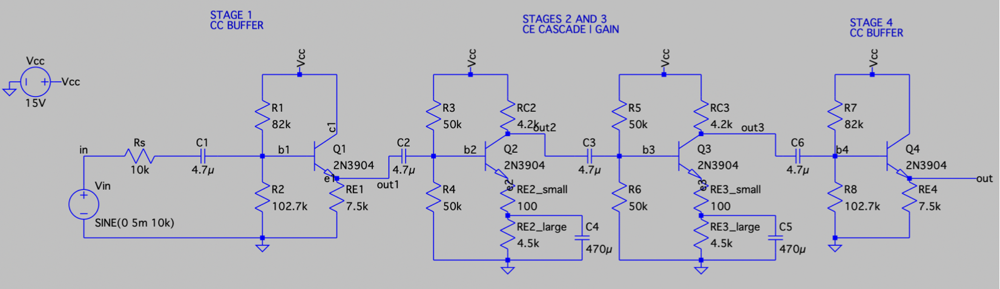
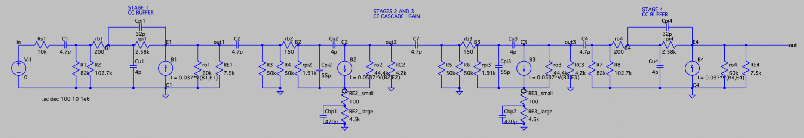
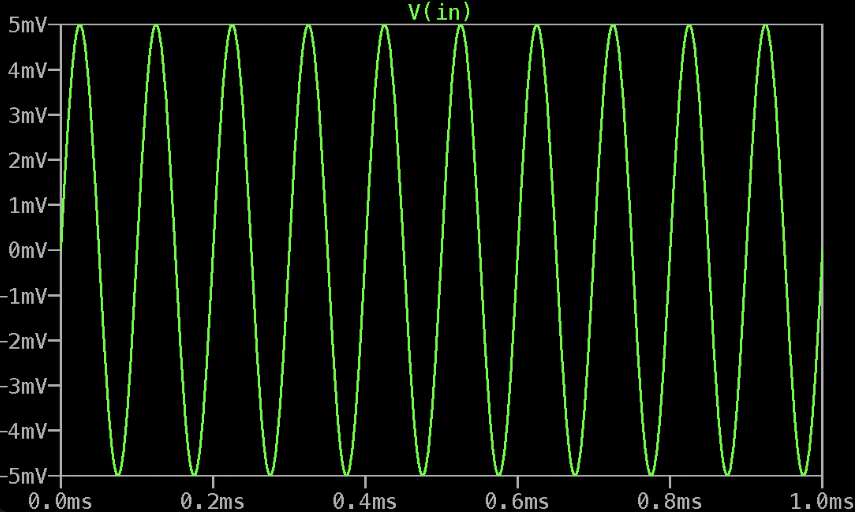
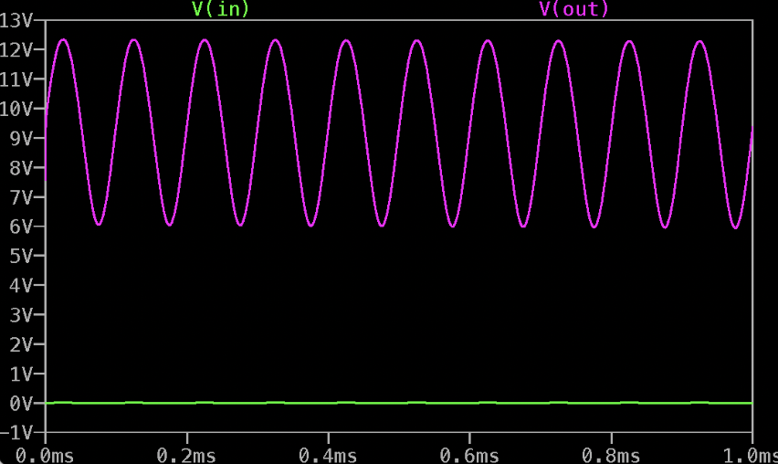
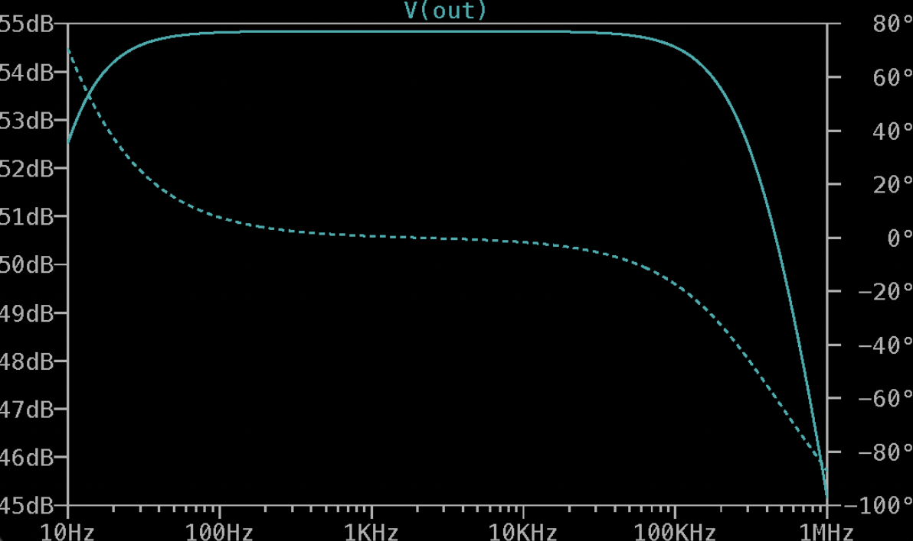
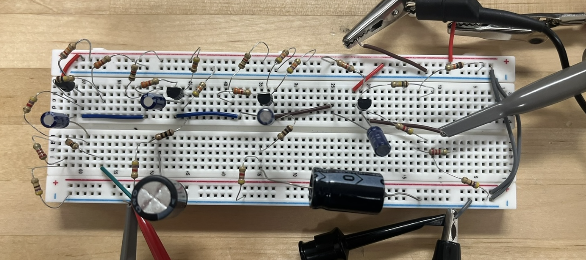
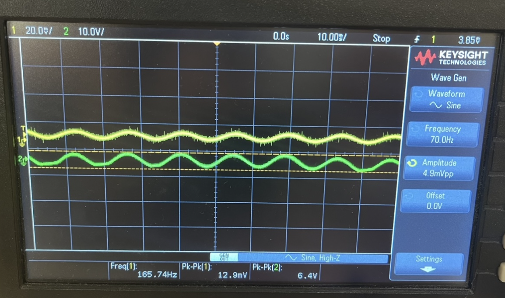
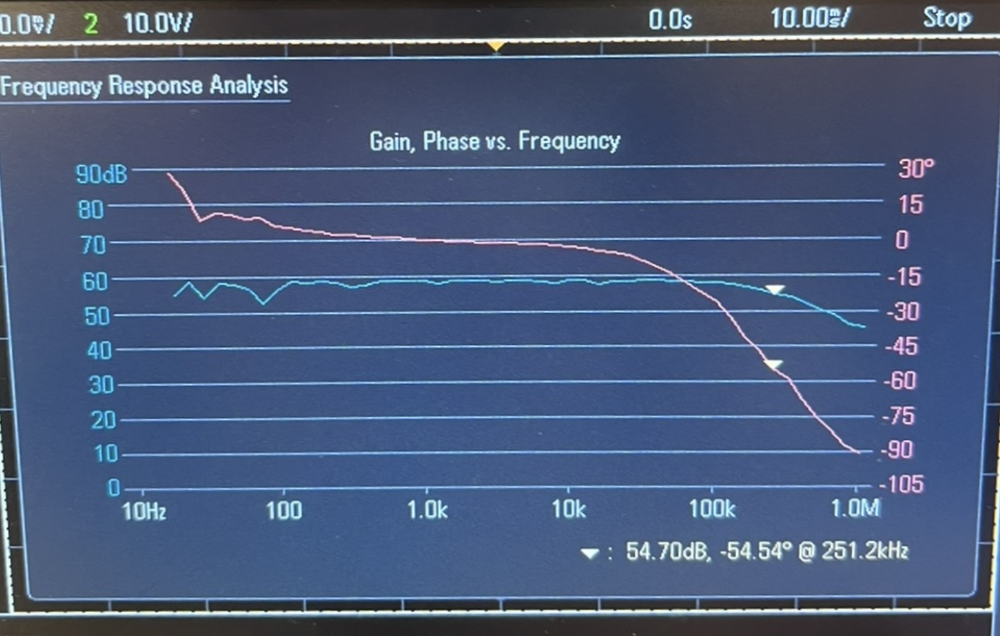

# Four-Stage BJT Voltage Amplifier

Analog Circuit Design | LTspice | Transistor Biasing | Small-Signal Analysis | Frequency Response

## Project Overview

This project involved designing, simulating, and experimentally validating a four-stage BJT voltage amplifier. The goal was to amplify a small AC input signal while meeting specific requirements for voltage gain, bandwidth, output resistance, bias stability, and power consumption.

The amplifier was designed using four 2N3904 NPN transistors, arranged into two common-collector buffer stages and two cascaded common-emitter gain stages. Component values were selected through DC bias calculations, small-signal analysis, and frequency-response considerations. The design was then simulated in LTspice and physically constructed on a breadboard for experimental testing.

The completed amplifier achieved a measured voltage gain of 497 V/V, an output swing of 6.4 Vpp, and a frequency response extending from 94 Hz to 251.2 kHz, satisfying the primary performance requirements.

## Design Requirements

The amplifier was designed around the following electrical specifications:

| Parameter | Requirement |
|---|---|
| Voltage Gain | > 250 V/V |
| Lower Cutoff Frequency | < 100 Hz |
| Upper Cutoff Frequency | > 200 kHz |
| Output Resistance | < 50 Ω |
| Output Voltage Swing | ≥ 5 Vpp without clipping |
| Supply Voltage | 15 V DC |
| Quiescent Power Consumption | < 150 mW |
| Bias Stability | < 6% collector current variation |
| Transistor Count | Maximum of four BJTs |
| Source Resistance | 10 kΩ |

These requirements influenced the selection of circuit topologies, transistor bias points, and passive component values.

## Circuit Architecture

The amplifier consists of four stages, each serving a different purpose in the overall design.

  

  <em>Figure 1. Functional block diagram of the four-stage BJT amplifier.</em>

### Stage 1: Input Buffer (Common-Collector)

The first stage uses a common-collector, or emitter-follower, configuration to isolate the input source from the following gain stages.

Because the common-emitter stages have relatively low input resistance, connecting them directly to the 10 kΩ source would introduce loading and reduce the effective input signal. The input buffer provides a higher input resistance and lower output resistance, allowing the signal to pass into the amplification stages with less attenuation.

The transistor was biased near the midpoint of the 15 V supply to provide sufficient headroom for the AC signal.

### Stages 2 and 3: Voltage Gain (Common-Emitter)

The second and third stages use cascaded common-emitter configurations to provide the majority of the amplifier's voltage gain.

Rather than achieving the entire gain through one transistor, the required amplification was distributed across two stages. This reduced the gain required from each individual stage and helped limit the effects of parasitic capacitance and the Miller effect on the upper cutoff frequency.

Emitter degeneration was used to improve bias stability and linearity, while bypass capacitors reduced AC degeneration to preserve voltage gain.

### Stage 4: Output Buffer (Common-Collector)

The final stage uses another emitter-follower configuration to reduce the amplifier's output resistance.

Although this stage does not contribute significant voltage gain, it allows the preceding common-emitter stage to drive the output with less loading. This was necessary to meet the specified output resistance of less than 50 Ω.

## Circuit Design and Analysis

The complete amplifier schematic was developed in LTspice using the selected transistor models and calculated component values.

  

  <em>Figure 2. Complete four-stage BJT amplifier schematic developed in LTspice.</em>

### DC Biasing

Each transistor was independently biased to establish a stable quiescent operating point within the forward-active region.

Resistor-divider networks were used to set the base voltages, while emitter resistors helped reduce sensitivity to variations in transistor current gain.

The common-collector stages were designed with emitter voltages near mid-supply to allow sufficient voltage swing. The common-emitter stages were biased to maintain adequate collector-emitter voltage and prevent saturation during amplification.

### Small-Signal Analysis

The amplifier was analyzed using the hybrid-π transistor model to estimate voltage gain, input resistance, output resistance, and frequency response.

Key parameters included:

- Transconductance (gm)
- Base-emitter resistance (rπ)
- Intrinsic emitter resistance (re)
- Early-effect output resistance (ro)
- Base-emitter and base-collector parasitic capacitances

The total voltage gain was estimated from the product of the individual stage gains, accounting for the attenuation introduced by the buffer stages.

### Frequency Response

The amplifier's frequency response was influenced by coupling capacitors, emitter bypass capacitors, and transistor parasitic capacitances.

Coupling and bypass capacitors were selected to maintain the lower cutoff frequency below 100 Hz. At higher frequencies, the Miller effect and transistor junction capacitances became the primary bandwidth limitations.

To better characterize these effects, a hybrid-π equivalent circuit was developed in LTspice.

  

  <em>Figure 3. Hybrid-π small-signal equivalent circuit used to analyze the amplifier's gain and frequency response, including transistor parasitic capacitances.</em>

## LTspice Simulation

The circuit was simulated in LTspice before physical construction to verify its operating points, voltage gain, and frequency response.

### Transient Analysis

A 10 kHz sinusoidal input with an amplitude of 5 mV was applied to the amplifier to evaluate its transient response.

  

  <em>Figure 4. Simulated 10 kHz sinusoidal input signal with a 5 mV amplitude.</em>

  

  <em>Figure 5. LTspice transient simulation showing the input and amplified output signals. The output maintains a sinusoidal waveform without visible clipping.</em>

The simulation produced an output swing of approximately 6.3 Vpp from a 10 mVpp input, corresponding to a voltage gain of approximately 630 V/V.

### AC Frequency Sweep

An AC sweep was performed to determine the amplifier's frequency response and identify its lower and upper cutoff frequencies.

  

  <em>Figure 6. LTspice Bode plot showing the amplifier's simulated magnitude and phase response.</em>

The simulation showed a relatively flat midband gain, with an upper cutoff frequency of approximately 344.4 kHz. This exceeded the required upper cutoff of 200 kHz.

The frequency response also demonstrated the effects of the coupling capacitors at low frequencies and transistor parasitic capacitances at high frequencies.

## Experimental Implementation and Testing

Following simulation, the amplifier was assembled on a breadboard using four 2N3904 transistors and the selected passive components.

  

  <em>Figure 7. Physical implementation of the four-stage BJT amplifier on a breadboard.</em>

### Voltage Gain Verification

The amplifier was tested using a function generator and oscilloscope to compare the input and output signals.

One challenge during testing was generating a sufficiently small input voltage. The available function generator could not directly produce the required millivolt-level signal without causing excessive output swing or clipping.

To address this, a resistive voltage divider was implemented at the input to attenuate the function generator signal while maintaining the required 10 kΩ source resistance.

  

  <em>Figure 8. Experimental oscilloscope measurements showing a 12.9 mVpp input signal and a 6.4 Vpp amplified output.</em>

The measured voltage gain was calculated as:

**Av = Vout / Vin = 6.4 Vpp / 12.9 mVpp ≈ 497 V/V**

This exceeded the required gain of 250 V/V while maintaining an output waveform without visible clipping.

### Frequency Response Verification

An experimental frequency sweep was performed using the oscilloscope's frequency-response analysis function.

  

  <em>Figure 9. Experimental Bode plot showing the amplifier's measured gain and phase response across frequency.</em>

The measured lower and upper cutoff frequencies were approximately 94 Hz and 251.2 kHz, respectively.

These results confirmed that the physical amplifier met the required operating frequency range.

## Results

The final design was evaluated against the original engineering requirements using analytical calculations, LTspice simulations, and experimental measurements.

| Parameter | Experimental Result | Requirement | Status |
|---|---|---|---|
| Voltage Gain | 497 V/V | > 250 V/V | Pass |
| Lower Cutoff Frequency | 94 Hz | < 100 Hz | Pass |
| Upper Cutoff Frequency | 251.2 kHz | > 200 kHz | Pass |
| Output Resistance | 26.2 Ω | < 50 Ω | Pass |
| Output Swing | 6.4 Vpp | ≥ 5 Vpp | Pass |
| Quiescent Power | 66.84 mW | < 150 mW | Pass |
| Bias Current Variation | < 6% | < 6% | Pass |
| Transistor Count | 4 | ≤ 4 | Pass |

The completed amplifier met all specified performance requirements.

## Design Tradeoffs and Troubleshooting

### Gain vs. Bandwidth

Increasing the voltage gain of a common-emitter stage also increases the effective input capacitance through the Miller effect, which can reduce the upper cutoff frequency.

To balance these requirements, the total voltage gain was distributed across two common-emitter stages rather than relying on a single high-gain stage.

### Gain vs. Bias Stability

Emitter degeneration improves transistor bias stability and linearity but reduces voltage gain.

A combination of bypassed and unbypassed emitter resistance was used to preserve DC stability while maintaining sufficient AC gain.

### Analytical vs. Experimental Gain

The calculated, simulated, and experimental voltage gains differed due to the assumptions made during analysis and nonideal behavior in the physical circuit.

Interstage loading, transistor parameter variations, parasitic capacitances, and breadboard wiring all contributed to the differences.

The design maintained sufficient margin above the minimum gain requirement to account for these effects.

### Low-Amplitude Signal Generation

Experimental testing required an input signal of only a few millivolts to prevent the high-gain amplifier from clipping.

Because the function generator could not directly provide the desired amplitude, a resistive voltage divider was used to create a smaller input signal while preserving the required source resistance.

## Future Improvements

Further work could explore alternative transistor amplifier topologies to improve voltage gain, bandwidth, and bias stability while reducing component count.

Additional testing could also examine the effects of temperature variation, transistor replacement, and different output loads.

Implementing the amplifier on a PCB rather than a breadboard would reduce parasitic wiring effects and provide a more compact and repeatable circuit.

## Project Information

**Course:** EE3415 – Electronics Design Project

**Institution:** University of Vermont

**Author:** Carissa Lee

**Date:** October 2026

**Software:** LTspice

**Hardware:** 2N3904 NPN Transistors, Resistors, Capacitors, Breadboard, Oscilloscope, Function Generator

**Project Scope:** Analog circuit design, DC bias analysis, small-signal modeling, frequency-response simulation, experimental validation, and circuit troubleshooting.
